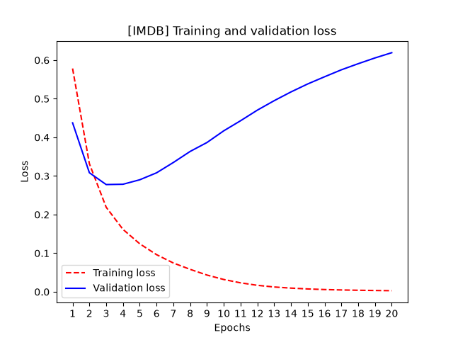
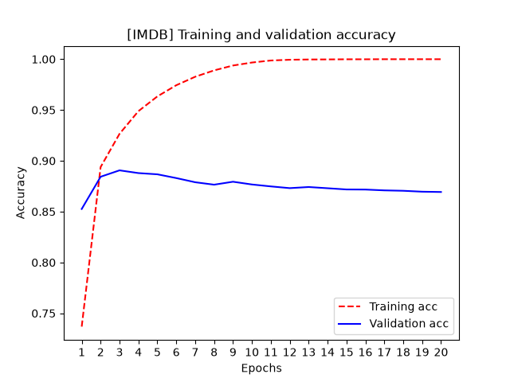

# Binary classification
## Description
04_binary_classification_imdb_recesion_good_or_bad.py -> model where inputs are the data in 0/1 representation
```python
def multi_hot_encode(sequences, num_classes):
    # Example input:
    # sequences = [
    #     [2, 5],
    #     [1, 2, 7]
    # ]
    #
    # Initial results matrix:
    # [
    #     [0, 0, 0, 0, 0, 0, 0, 0],
    #     [0, 0, 0, 0, 0, 0, 0, 0]
    # ]
    #
    # After multi-hot encoding:
    # [
    #     [0, 0, 1, 0, 0, 1, 0, 0],
    #     [0, 1, 1, 0, 0, 0, 0, 1]
    # ]
    # Creates an all-zero matrix of shape (len(sequences), num_classes)
    results = np.zeros((len(sequences), num_classes))
    for i, sequence in enumerate(sequences):
        # Sets specific indices of results[i] to 1s
        # -> Function called advanced indexing
        results[i][sequence] = 1.0
    return results
```

## Model representation
<p align="center">
  
</p>

<p align="center">
  <em>
    Source: François Chollet and Matthew Watson,
    Deep Learning with Python, Chapter 4.
  </em>
</p>

## Model output
### Loss and accuracy (20epochs)
<p align="center">
  
</p>

<p align="center">
  
</p>


- Unexpectly loss is starting to grow at ~4th iteration
- Model started overfitting after 4th iteration
- Started overoptimizing on the training data and end up learning representations that are specific to training data
- Didn't generalize to data outside of training set
- Accuracy also drops

### Example predictions and texts
```
Index: 2243
Prediction: 0.9999964
x_test: [0. 1. 1. ... 0. 0. 0.]
Decoded text: ? thirty years prior to the deer hunter came this movie an excellent ? on the effects of war inflicted on the american family as seen from both the war heroes and their wives a truly ironic title the best years of our lives is anything but since those times have ? into still images and all that is left is an uncertain future for those involved br br truly an ensemble cast despite the top billing of myrna loy the best years of our lives focuses more on the stories of the men al ? march comes back to a household that has ? changed as his sons have grown although he finds support from his ? wife ? myrna loy fred ? upon returning cannot find a decent job despite being a war veteran and is trapped in a marriage that he does not want to marie a happy go lucky girl who wants more out of life and who increasingly comes to hate him homer ? on the other hand has greater problems due to his loss of hands at war and feels the entire world including the girl he loves and her family thinks he is a freak of nature br br at almost three hours of length the film never seems long and drawn out there is so much emotions happening even in small moments that the plot ? by nothing seems wasted or placed on screen due to a lack of editing not a performance rings false though the ? are those of dana andrews as fred ? harold russell as homer ? and virginia ? as marie ? even then every character has his or her moment on film and the time was right to talk about all the pain and suffering that until then had not been seen in american films including the ones made around world war one which did not ? in such topics while there is never any overt violence it's all there in the haunted expressions of the three male ? faces in the lot where the planes now ? ready to be turned into junk and therefore in the cynicism of the store owners who couldn't be bothered to employ these shell shocked men who had seen battle or even worse to ? them into wondering what was it all worth for this is the film in which coming home and born on the fourth of july are ? to at a time when america ? from war films to come up with this when the end of the second world war was still fresh was a necessity in order to make a more honest film making
----------------------------------------------------------------------------------------------------
Index: 19377
Prediction: 0.9902222
x_test: [0. 1. 1. ... 0. 0. 0.]
Decoded text: ? death bed the bed that eats br br judging from the title you can guess what this movie is about and yet there is a lot more background story to this film then one might suspect br br okay so the main plot is about a bed eating people and food but there are also a few subplots i won't spoil them for you but they're a nice touch br br sadly the acting in this movie is very mediocre the fact that most dialog is not even spoken by the actors doesn't really help to improve the quality of the movie as a whole br br because there is a lot of voice over work the thoughts of characters are also revealed to the ? sometimes it works sometimes it doesn't br br the effects are fine sure it could be a lot better if you compare it with today's movies but you really shouldn't just judge the movie as it is and don't take it too seriously you have to admit that a killer bed is quite creative if you are easily ? don't watch this movie you might never want to sleep again br br death bed the bed that eats is a strange horror gem with a low budget but i'd still recommend it to fans of horror movies br br in conclusion i give this movie a 7 out of 10 stars for it's creative story and unexpected twists here and there
----------------------------------------------------------------------------------------------------
Index: 2310
Prediction: 0.99999946
x_test: [0. 1. 1. ... 0. 0. 0.]
Decoded text: ? this really is a movie that you need to see twice when i first saw this film i was really drawn into the story while the majority of the story takes place inside of a hotel room the stories that buddy nick drake wonderful ? and daphne share take you outside of their room and into their world through their conversations you get a feel for the loneliness and pain that each feels the soundtrack ? the movie perfectly dark lo fi and intriguing when you see the film the second time around you can pick up all of the clues that you missed the first time around leading up to one of the best ending i have seen in a long time i hope to see this movie find a ? for the dvd so that it will be more accessible great movie you won't be disappointed
----------------------------------------------------------------------------------------------------
Index: 16424
Prediction: 0.9986619
x_test: [0. 1. 1. ... 0. 0. 0.]
Decoded text: ? one of my favorite westerns and one of john ford's best in my opinion no major stars but ben johnson shines in most everything he appears and here he gets a rare lead as the title character matching him is ward bond as the ? mormon elder leading his people west john ford's stock of character actors including harry carey jr jane ? russell simpson and hank ? provide ample support as does ? silent james ? a member of the outlaw ? clan that joins up with the ? train the mormon trail into ? was one of the most ? and demanding ? ever ? we can't really get the feel of that but we do see ? that had to be overcome by ? on the way west river ? long stretches of dry desert encounters with indians and the like all set to glorious song by the sons of the ? the ? actually did dig sections of the trail with picks and ? as depicted in the movie my main regret is that it wasn't made in color but i believe there is a ? version by the way those ? rocks featured in various scenes are called the fisher towers located near highly recommended viewing
----------------------------------------------------------------------------------------------------
Index: 11069
Prediction: 0.9996559
x_test: [0. 1. 1. ... 0. 0. 0.]
Decoded text: ? i gave 9 of 10 points i was sitting in tears nearly the whole movie because i had to laugh br br the story of course wasn't excellent but it also wasn't boring ? are assigned to become ? for the beautiful nina while doing this job they come between the front lines of and cia of course the two are neither born ? nor gentlemen so they run from one disaster into another and they do this in such a funny way that when you watch some scenes you won't be able to stop the tears as actors those two ? ? characters do quite well better than some so called professional br br you think the speech of the two heroes is ? or pseudo foreign well if you hear quite a lot turkish german people in ? speaking exactly like them you will remember ? and maybe in 10 years it might have become the common speech of the youth god ? br br so if you like to laugh watch this movie
----------------------------------------------------------------------------------------------------
Index: 10912
Prediction: 0.99942756
x_test: [0. 1. 1. ... 0. 0. 0.]
Decoded text: ? yes it's a fast times wannabe but it's still decent entertainment br br some of the comedy parts are really funny the scene when the three guys visit the spanish lady is hilarious with a little flamenco music in the background the reaction when her sailor husband comes home is a riot the ? exploits in dealing with ? are funny as well when they try to ? them and when they visit the ? br br the abortion scene is a fast times ripoff too but it does do a good job of capturing the terror of the situation you really feel for what karen is going through and for gary in his mad ? for cash to pay for the abortion and ? her ? br br the ending is painful to watch but ? realistic first time viewers will not be prepared for it and it will be a shock br br there is a decent eye candy for guys with young girls and the ? spanish lady but ? guys will probably want to skip the penis ? competition br br underrated soundtrack too check out early early ? the cars in their prime and an appropriate ? song by james ? for the surprise ending br br some people will hate it and it is somewhat dated but those who like teen flicks or grew up in the early 80s should like it
----------------------------------------------------------------------------------------------------
Index: 17459
Prediction: 0.9994647
x_test: [0. 1. 1. ... 0. 0. 0.]
Decoded text: ? this movie was great and funny ? is funny the best looking girl is all the way ? she is totally hot in this film and she proves she can act with this film this movie is a must see comedy and its not all about ? its a great movie in general but ? adds the ? to this film cause she does her scenes very well and she is all the way sexy
----------------------------------------------------------------------------------------------------
Index: 2424
Prediction: 0.98338044
x_test: [0. 1. 1. ... 0. 0. 0.]
Decoded text: ? the ? strike again i had no going in and i was amazed at the bizarre telling of a good bad guy story although clooney is easily in this his ? style is welcome ? and nelson are dead and i loved i am a man of constant sorrow as performed by the ? bottom boys catchy tune br br 8 of 10
----------------------------------------------------------------------------------------------------
Index: 5055
Prediction: 0.8651555
x_test: [0. 1. 1. ... 0. 0. 0.]
Decoded text: ? a truly scary film happening across ? james ? led me to recently formed web ? like life after the oil crash energy ? and the oil drum and the data behind the theory of peak like this film and paint a grim picture of die off or die back i hope they're ? but in mid 2005 rising ? ? rising oil ? will you join us campaign ? becoming beyond ? and even t ? ? lend ? to the idea that we are at or near a peak of oil production br br after ? research of limited data oil investment ? matt simmons has suggested that the may no longer be able to increase production in their immense but aging fields in the face of ? demand primarily from the us and china the have not ? with higher production despite previous ? stated world production from 2000 and 2004 ? that light sweet crude has indeed ? which means that will become more ? br br the film seems aimed at baby ? but younger people our children also need to understand the ? of an energy ? future
----------------------------------------------------------------------------------------------------
Index: 21488
Prediction: 0.9641654
x_test: [0. 1. 1. ... 0. 0. 0.]
Decoded text: ? this is a story of a long and awkward love the daily life of a woman of 50 years old and some people around her is depicted her daily life is so ordinary and routine that i ? who was the real lead character in the beginning then the audiences know that the woman and a man who was her high school class mate had very tiny connection the woman has been doing the same job a milk woman and a supermarket so long there are so many ? that delivering milk ? is a very hard job the man had married another woman who is now dying of cancer he works at the city hall and ? cares her at home they never look straight nor talk each other but they never forget each other br br the original japanese title means at some time the days you read books but of course when the man said now i want to do what i've always wanted to do it was to hug her and make love with her she writes to a radio ? ? that if god gives us time to talk we need at least a whole day dreaming of that day she has been the desire in hard work and book reading i personally know a woman who has loved a man for long years even after he married another woman and died for an accident therefore the story setting is not that special rather this movie well portrays ? romances in many ordinary men and women through this movie you will recall your romance that is lost long ago this is a movie with lasting effect
----------------------------------------------------------------------------------------------------
Index: 19451
Prediction: 0.006783052
x_test: [0. 1. 1. ... 0. 0. 0.]
Decoded text: ? to keep from being bored during love and sex first i tried to think of all the movies this was of breaking up with russell ? and ? ? though that had a more original ending about last night with rob lowe and a lot of tv shows br br second was ? just how gorgeous ? is so i couldn't believe for a ? that she could have a problem getting a date she is certainly in line to give julia roberts a run for her money literally and wasn't julia in some movie with this same plot or other br br third was trying to figure out why the writer director bothered to give jon character the jewish name of adam levy he even refers to eating a ham ? br br fourth was trying to figure out why some critics had given this a good review which is why i was in the theater br br originally written 9 2 2000
----------------------------------------------------------------------------------------------------
Index: 10014
Prediction: 0.0045428844
x_test: [0. 1. 1. ... 0. 0. 0.]
Decoded text: ? this is a very very odd film one that is so odd it's best you just see it for yourself the film begins with a jaded professor ? his class because the students have the ? to not be as incredibly brilliant as he is you can tell very quickly that this man is a total ? finding the value in practically nothing but sticking to his own inner sense of self importance additionally he seems tired and bored with the ? of life br br later in the film he walks into a bank robbery and manages to annoy the robbers so much that one of them shoots him in the head oddly this is only half way through the film and what followed was a very bizarre narration of the final seconds of his life this is when the film becomes exciting because the style of the narration is just like one of this literature ? novels one that is intelligently written and says things the way we wish we could all say them br br see this weird film it's amazingly compelling and not like anything i've ever seen before
----------------------------------------------------------------------------------------------------
Index: 9191
Prediction: 1.6493961e-05
x_test: [0. 1. 1. ... 0. 0. 0.]
Decoded text: ? barney is just awful as many of the other reviews on this show say i'm not one to disagree with them i won't because i hate this show just as much as they do they use kids that look like they're in sixth grade cheesy plots horrid dialog and really crappy special effects not to mention that big purple dinosaur himself he makes every other kid show look like award winners ? street has won awards that i know about br br please just watch ? street thomas the tank engine or even the ? avoid both this and its movie which i also reviewed they are both extremely crappy and are inappropriate to anyone even little babies
----------------------------------------------------------------------------------------------------
Index: 16060
Prediction: 0.0001838173
x_test: [0. 1. 1. ... 0. 0. 0.]
Decoded text: ? ? ? folks i'm not going to lie to you is a one or two hit wonder but what a film it almost excuses suspect zero i'm also not going to pretend to understand it completely half of what makes it what it is is trying to second guess what the hell they are doing on the screen because of the ? br br richard says it is as if a cult had re ? for real three bible stories creation the ? and ? torture and death on that's not a bad description but there seems to be more to it than the seemingly one to one religious br br there's an ? theme right up near the surface note that toward the end after the of the landscape there are large ? not unlike those on a construction site oh no he's going to say look at how people are ? mother nature one rarely sees a dead metaphor in action and with this much ? but to see it acted out is way than language implies br br and yeah if you just want something to sync with a death metal soundtrack it does have the requisite atrocities but as for myself and others like me it's an important art film that should merit a ? collection release ranks right up there with ? ? br br ray
----------------------------------------------------------------------------------------------------
Index: 20499
Prediction: 3.97354e-08
x_test: [0. 1. 0. ... 0. 0. 0.]
Decoded text: ? i really hated this movie and it's the first movie written by stephen king that i didn't finish i was truly disappointed it was the worst crap i've ever seen what were you thinking making three hours out of it it may have a quite good story but actors no suspense no romance no horror no it didn't have anything br br it's got this strange crazy science man with einstein hair the classic thing not real at all and a man keep getting younger all the time it seems like they just used the name of stephen king to make a crappy too long movie with nothing exciting at all br br i give this movie 1 awful if they had like 5 i would probably take that instead it was a total waste of time
----------------------------------------------------------------------------------------------------
Index: 4529
Prediction: 9.12946e-10
x_test: [0. 1. 1. ... 0. 0. 0.]
Decoded text: ? i never read the book now i don't really want to i had no clue what this movie was about when i walked into the theatre i still don't really know what point it was supposed to get across but i do know that a good two hours was wasted from my life two precious hours i can never get back br br the storyline was so predictable it's laughable werewolves or something a very romeo and juliet type plot i predicted the within five minutes into the movie and i was correct br br the acting isn't horrible the only two cool characters in the movie were the british cousin guy and the rambo graphic novel the other characters are too the dialogue is very bland and predictable br br the absolute worst part of the movie is the ? between the humans and the wolves if you wanted something kick ass like van you're gonna be really upset imagine a bright light then a wolf yep that's about it br br just avoid this movie period especially if you've read the book because you'll just wanna punch babies
----------------------------------------------------------------------------------------------------
Index: 11189
Prediction: 5.370155e-06
x_test: [0. 1. 1. ... 0. 0. 0.]
Decoded text: ? some modern horror movies are very good strong plot scary moments good acting while others are just unfortunately belongs to the latter camp br br i will rate the movie based on 3 elements plot scary factor and acting br br 1 plot true to the name the movie the plot moves in circle and never really explains itself ok the town is captivated by the spiral curse but why and why do people act so ? there is a fleeting attempt to explain about what is happening by the reporter br br 2 scary factor if this was meant to be a horror flick it has failed miserably i can't really remember one good scary scene with plenty of build up to it br br 3 acting very monotonous people walking around saying meaningless ? i can't really feel much empathy for our tragic heroes br br all in all there are much better modern japanese horror movies out there with coherent plot and strong characterization don't bother wasting your time on this wannabe
----------------------------------------------------------------------------------------------------
Index: 12432
Prediction: 0.0052978317
x_test: [0. 1. 1. ... 0. 0. 0.]
Decoded text: ? the nest is really just another run horror flick that fails because of the low budget the acting is ok and the setting is great but somehow the whole film just seemed a bit dull to me the gore effects are not the best i've seen but are fun in a cheesy sort of way the ? themselves are just regular ? that bite people the nest reminded me of a much better film called slugs if you liked the nest then slugs is a must see as it's ten times better also worth noting is that lisa who plays elizabeth was in another run type film called deadly eyes aka the rats which is about killer rats as you may have guessed br br if you enjoy these types of horror films then you may want to give this a watch but you'd be far better off seeing slugs which is far more interesting and gory
----------------------------------------------------------------------------------------------------
Index: 13594
Prediction: 4.4092085e-06
x_test: [0. 1. 1. ... 0. 0. 0.]
Decoded text: ? this is 1 hour and 24 minutes of pure boredom br br in this ? movie even the gun baldwin uses hk sucks it was sent to ? by armed forces worldwide in the mid eighties and is now only used by terrorists bank robbers and military ? br br if i had known this movie was this bad i would rather watch 10 episodes of ? saving the planet br br no groove no drive and no feel watch the channel – it's more ? than this sorry excuse for a movie this movie doesn't deserve a on the scale better luck next time baldwin until then i'll sit here watch my ? grow – that is far more ? than
----------------------------------------------------------------------------------------------------
Index: 23144
Prediction: 3.087834e-08
x_test: [0. 1. 1. ... 0. 0. 0.]
Decoded text: ? i only came here to check terror hospital for an alternate title so i'd know what not to pick up not only do i get the original title but i come to find terror hospital is one of seven more ? this one is a real ? movies like this can usually be forgiven for any number of reasons mostly ? consequences of the feature on every level of production that result in at least a mild form of entertainment mostly amusement this has none of that instead the viewer is witness to ? unnecessary and way too convenient for the situation exposition and drawn out scenes of characters ? moving from room to room and all this is half of the film forget trying to figure out where anybody is or who they are during ? or ? scenes too you probably won't care anyway there is also a random car chase sequence that seems quite dull when compared to some of the old ? ed movies i er i mean sat through and watched way back in high school really we're talking about ? possession and a killer on the loose here not a bad recipe for trash cinema unfortunately there's nothing here to make it even good trash when joined to the aforementioned the bad acting and not so special effects are just that bad acting and not so special effects this one's just trash pure and simple leave it on the rack at the ? shop or in that box at the yard sale there's a reason its there
----------------------------------------------------------------------------------------------------
```

### Testing other configurations
Changed 16 neurons to 128 -> 4 epochs
-> [0.47321653366088867, 0.8623999953269958]
-> bigger loss, less accuracy

3 Dense layers 16 neurons -> 4 epochs
-> [0.3372217118740082, 0.8762800097465515]

1 Dense layers 16 neurons -> 4 epochs
[0.2855941355228424, 0.8864799737930298]

changed loss to mean_squared_error
-> [0.08911078423261642, 0.8785600066184998]
-> looks like here the loss is smallest