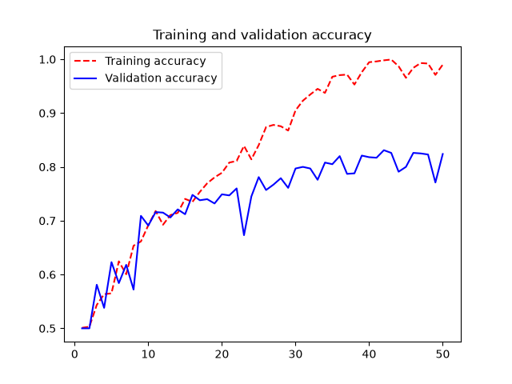
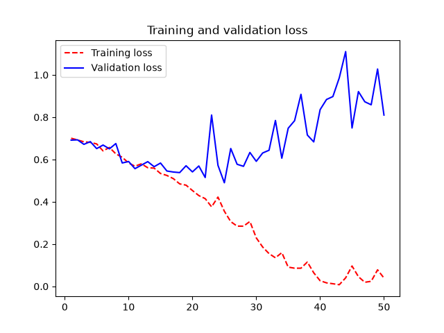
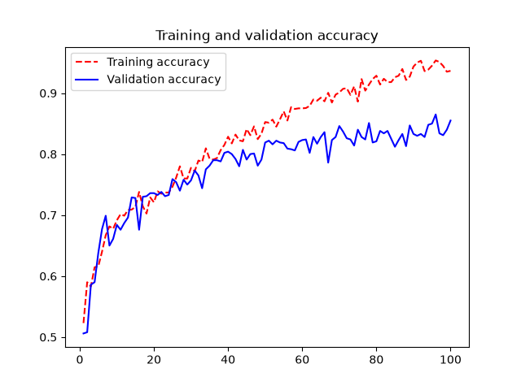
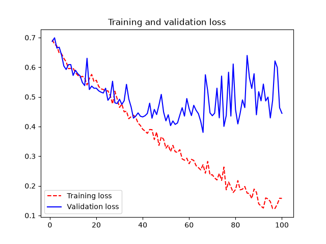
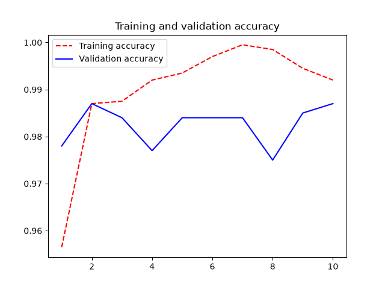
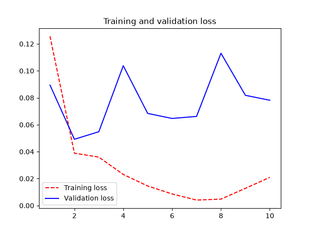
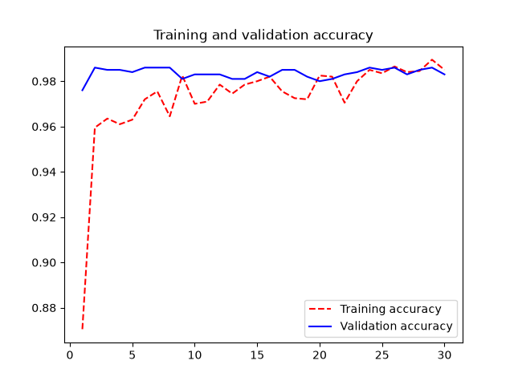
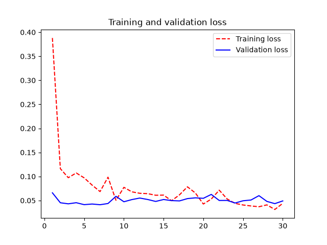
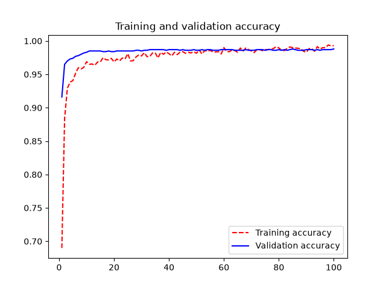
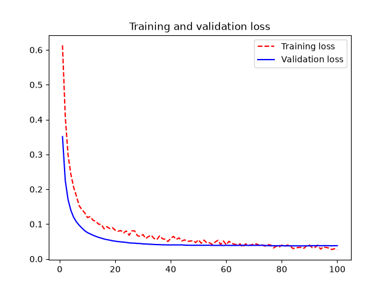

# ConvNet from basic one till pretrained model with some optimization
- Starting from simple convnet with few layers (1)
- Adding augumentation (2)
- Pretrained model with custom classifier -> data passed to classifier via numpy arrays (3)

## 1. Dogs vs Cats (ch_08_convnet/dogs_vs_cats.py)
Simple convnet using few layers
No optimizations, no adjustments

Below most relevant part of model
```python
inputs = keras.Input(shape=(180, 180, 3))
# Rescales inputs to the [0, 1] range by dividing them by 255
x = layers.Rescaling(1.0 / 255)(inputs)

x = layers.Conv2D(filters=32, kernel_size=3, activation="relu")(x)      # 180 -> 178
x = layers.MaxPooling2D(pool_size=2)(x)                                 # 178 -> 89

x = layers.Conv2D(filters=64, kernel_size=3, activation="relu")(x)      # 89 -> 87
x = layers.MaxPooling2D(pool_size=2)(x)                                 # 87 -> 43

x = layers.Conv2D(filters=128, kernel_size=3, activation="relu")(x)     # 43 -> 41
x = layers.MaxPooling2D(pool_size=2)(x)                                 # 41 -> 20

x = layers.Conv2D(filters=256, kernel_size=3, activation="relu")(x)     # 20 -> 18
x = layers.MaxPooling2D(pool_size=2)(x)                                 # 18 -> 9

x = layers.Conv2D(filters=512, kernel_size=3, activation="relu")(x)     # 9 -> 7

# Converts the 3D activations with shape (7, 7, 512) into a 1D vector
# with shape (512,) by averaging each feature map over its spatial dimensions
x = layers.GlobalAveragePooling2D()(x)
```

### Model accuracy -> 77.5%
<div style="display: flex; gap: 10px;">
  
  
</div>

## 2. Dogs vs Cats with augumentation and dropout (ch_08_convnet/dogs_vs_cats_augmented_and_dropout.py)
Augumentation gives slightly better effect if the augumented data will be in test data otherwise might be pointless

Below most relevant part of model
```python
inputs = keras.Input(shape=(180, 180, 3))

# Rescales inputs to the [0, 1] range by dividing them by 255
x = layers.Rescaling(1.0 / 255)(inputs)

x = layers.Conv2D(filters=32, kernel_size=3, activation="relu")(x)      # 180 -> 178
x = layers.MaxPooling2D(pool_size=2)(x)                                 # 178 -> 89

x = layers.Conv2D(filters=64, kernel_size=3, activation="relu")(x)      # 89 -> 87
x = layers.MaxPooling2D(pool_size=2)(x)                                 # 87 -> 43

x = layers.Conv2D(filters=128, kernel_size=3, activation="relu")(x)     # 43 -> 41
x = layers.MaxPooling2D(pool_size=2)(x)                                 # 41 -> 20

x = layers.Conv2D(filters=256, kernel_size=3, activation="relu")(x)     # 20 -> 18
x = layers.MaxPooling2D(pool_size=2)(x)                                 # 18 -> 9

x = layers.Conv2D(filters=512, kernel_size=3, activation="relu")(x)     # 9 -> 7

# Converts the 3D activations with shape (7, 7, 512) into a 1D vector
# with shape (512,) by averaging each feature map over its spatial dimensions
x = layers.GlobalAveragePooling2D()(x)
# Dropout is a regularization technique that randomly sets a fraction of the input units to 0 at each update during training time, which helps prevent overfitting
x = layers.Dropout(0.25)(x)

...

data_augmentation_layers = [
    layers.RandomFlip("horizontal"),
    layers.RandomRotation(0.1),
    layers.RandomZoom(0.2),
]

# Creates a function that applies them sequentially
def data_augmentation(images, targets):
    for layer in data_augmentation_layers:
        images = layer(images)
    return images, targets

# Maps this function into the dataset
augmented_train_dataset = train_dataset.map(
    data_augmentation, num_parallel_calls=8
)
# Enables prefetching of batches on GPU memory; important for best
# performance
augmented_train_dataset = augmented_train_dataset.prefetch(tf.data.AUTOTUNE)
```
### Model accuracy -> 82.5%
<div style="display: flex; gap: 10px;">
  
  
</div>

## 3. Dogs vs Cats using pretrained model -> features extracted as numpy array and feed into head (ch_08_convnet/dogs_vs_cats_pretrained_model_xception_train_only_classifier.py)
There are 2 ways of reuse pretrained model
- Extract features and feed it to the custom clasiffer (this example) -> data provided as numpy arrays
- Passthrough the data through whole pretrained model and block training, data provided as regular tensor output

Below most relevant part of model
```python
# --- START FEATURE EXTRACTION
def get_features_and_labels(dataset):
    all_features = []
    all_labels = []

    for images, labels in dataset:
        preprocessed_images = (
            # Use older implementation of preprocessor to avoid issues with keras_hub on macOS
            keras.applications.xception.preprocess_input(images)
        )
        # Commenting out -> on macOS runnigng tensorflow-metal is not working with keras_hub, so using keras.applications.preprocess_input() instead
        # preprocessed_images = preprocessor(images)

        # Main part: extract features using the pretrained model
        features = conv_base.predict(
            preprocessed_images,
            verbose=0,
        )

        all_features.append(features)
        all_labels.append(labels)

    return (
        np.concatenate(all_features),
        np.concatenate(all_labels),
    )

# EXTRTACT FEATURES FOR ALL DATASETS FORM PRETRAINED MODEL
train_features, train_labels = get_features_and_labels(train_dataset)
val_features, val_labels = get_features_and_labels(validation_dataset)
test_features, test_labels = get_features_and_labels(test_dataset)

...

# --- START MODEL DEFINITION
from keras import layers
# Note:
# !IMPORTANT
# In this case we are applying only top layers to the features extracted 
# from the pretrained model -> features are extracted to the numpy arrays
# The pretrained model is frozen and not trained
inputs = keras.Input(shape=(6, 6, 2048))
# Averages spatial dimensions to flatten the feature map
x = layers.GlobalAveragePooling2D()(inputs)
x = layers.Dense(256, activation="relu")(x)
x = layers.Dropout(0.25)(x)
outputs = layers.Dense(1, activation="sigmoid")(x)
model = keras.Model(inputs, outputs)

...

history = model.fit(
    train_features,
    train_labels,
    epochs=10,
    validation_data=(val_features, val_labels),
    callbacks=callbacks,
)
```
### Model accuracy -> 98.3%
<div style="display: flex; gap: 10px;">
  
  
</div>

## 4. Dogs vs Cats using pretrained model -> add pretrained model and freeze updating, train head only + augumentation added (ch_08_convnet/dogs_vs_cats_pretrained_model_xception_train_only_classifier_and_data_augumentation.py)
Passthrough the data through whole pretrained model and block training, data provided as regular tensor output
Below most relevant part of model
```python
conv_base.trainable = False

inputs = keras.Input(shape=(180, 180, 3))

# Converts pixel values from [0, 255] to [-1, 1]
x = keras.applications.xception.preprocess_input(inputs)
# Newer preprocesing implementation commended due to issues with keras_hub on macOS
# x = preprocessor(inputs)

# Runs the pretrained model in inference mode
x = conv_base(x, training=False)

x = layers.GlobalAveragePooling2D()(x)
x = layers.Dense(256, activation="relu")(x)
x = layers.Dropout(0.25)(x)
outputs = layers.Dense(1, activation="sigmoid")(x)

model = keras.Model(inputs, outputs)

...
# --- START DATA LOADING
...
batch_size = 64
image_size = (180, 180)
train_dataset = image_dataset_from_directory(
    new_base_dir / "train", image_size=image_size, batch_size=batch_size
)
validation_dataset = image_dataset_from_directory(
    new_base_dir / "validation", image_size=image_size, batch_size=batch_size
)
test_dataset = image_dataset_from_directory(
    new_base_dir / "test", image_size=image_size, batch_size=batch_size
)
# --- END DATA LOADING
# --- ADD DATA AUGMENTATION
import tensorflow as tf

# Defines the transformations to apply as a list
data_augmentation_layers = [
    layers.RandomFlip("horizontal"),
    layers.RandomRotation(0.1),
    layers.RandomZoom(0.2),
]

# Creates a function that applies them sequentially
def data_augmentation(images, targets):
    for layer in data_augmentation_layers:
        images = layer(images)
    return images, targets

# Maps this function into the dataset
augmented_train_dataset = train_dataset.map(
    data_augmentation, num_parallel_calls=8
)
# Enables prefetching of batches on GPU memory; important for best
# performance
augmented_train_dataset = augmented_train_dataset.prefetch(tf.data.AUTOTUNE)

...

history = model.fit(
    augmented_train_dataset,
    epochs=30,
    validation_data=validation_dataset,
    callbacks=callbacks,
)
```
### Model accuracy -> 98.0%
<div style="display: flex; gap: 10px;">
  
  
</div>

## 4. Dogs vs Cats using pretrained model -> add pretrained model with trainable last 4 layers + smaller learnig rate (learning_rate=1e-5) + augumentation (ch_08_convnet/dogs_vs_cats_pretrained_model_xception_train_only_classifier_and_data_augumentation.py)

Below most relevant part of model
```python
# --- START MODEL DEFINITION
# Enables fine-tuning for the convolutional base
conv_base.trainable = True

# conv_base.layers contains all layers of the pretrained model
# [:-4] selects every layer except the last four
# The loop visits each selected layer and freezes it
# Frozen layers keep their pretrained weights unchanged during training
for layer in conv_base.layers[:-4]:
    layer.trainable = False

inputs = keras.Input(shape=(180, 180, 3))

# Converts pixel values from [0, 255] to [-1, 1]
x = keras.applications.xception.preprocess_input(inputs)
# Newer preprocesing implementation commended due to issues with keras_hub on macOS
# x = preprocessor(inputs)

# Runs the pretrained model in inference mode
x = conv_base(x, training=False)

x = layers.GlobalAveragePooling2D()(x)
x = layers.Dense(256, activation="relu")(x)
x = layers.Dropout(0.25)(x)
outputs = layers.Dense(1, activation="sigmoid")(x)

# ADD CUSTOM LEARNIG RATE
model.compile(
    loss="binary_crossentropy",
    # !IMPORTANT
    # Using a lower learning rate for the Adam optimizer to avoid large updates to the weights, for now lets use only that
    optimizer=keras.optimizers.Adam(learning_rate=1e-5),
    metrics=["accuracy"],
...

# --- ADD DATA AUGMENTATION
# Defines the transformations to apply as a list
data_augmentation_layers = [
    layers.RandomFlip("horizontal"),
    layers.RandomRotation(0.1),
    layers.RandomZoom(0.2),
]

# Creates a function that applies them sequentially
def data_augmentation(images, targets):
    for layer in data_augmentation_layers:
        images = layer(images)
    return images, targets

# Maps this function into the dataset
augmented_train_dataset = train_dataset.map(
    data_augmentation, num_parallel_calls=8
)
# Enables prefetching of batches on GPU memory; important for best
# performance
augmented_train_dataset = augmented_train_dataset.prefetch(tf.data.AUTOTUNE)

...

history = model.fit(
    augmented_train_dataset,
    epochs=100,
    validation_data=validation_dataset,
    callbacks=callbacks,
)
```
### Model accuracy -> 98.7%
<div style="display: flex; gap: 10px;">
  
  
</div>